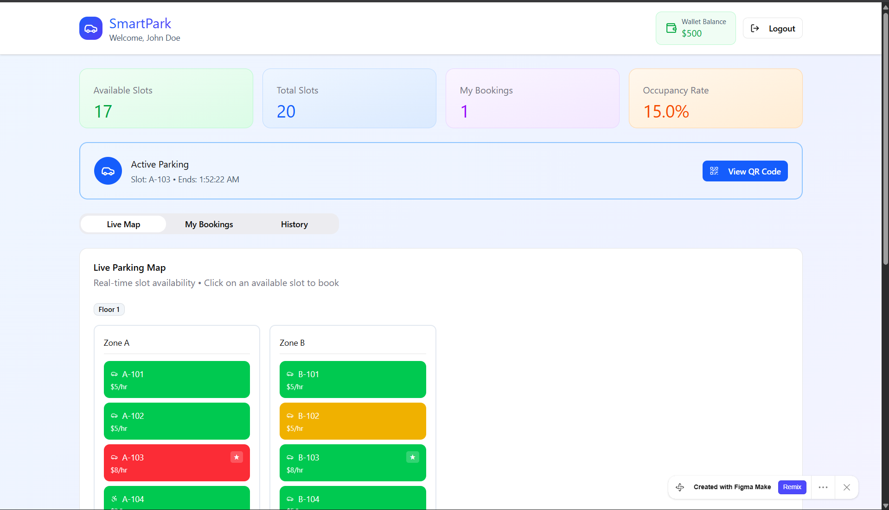
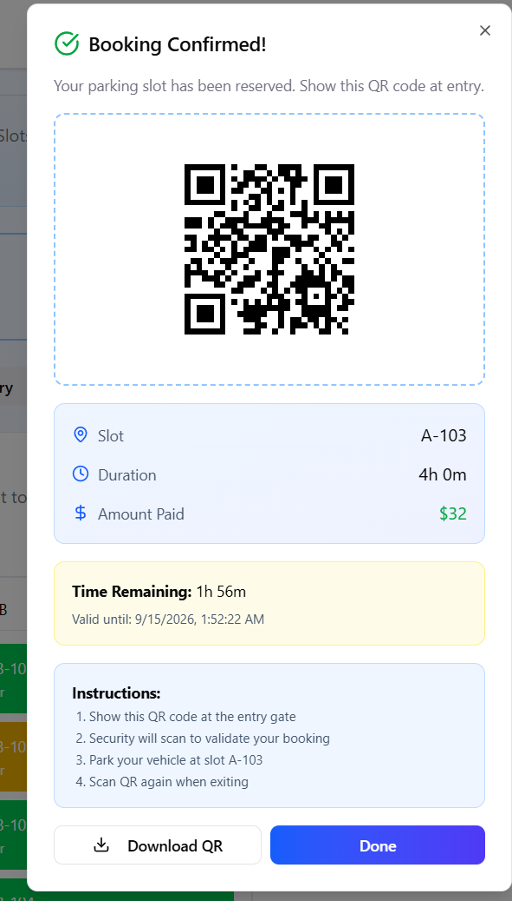

# 🅿️ SmartPark — Smart Parking Management App

SmartPark is a smart parking management application that lets users view real-time slot availability, book parking spots, pay from an in-app wallet, and check in/out using a QR code.

🔗 **Live Demo:** [affix-flint-58795502.figma.site](https://affix-flint-58795502.figma.site/)

---

## 📸 Screenshots

### Dashboard & Live Parking Map
Real-time overview of slot availability, occupancy rate, and active parking session, with a live map of slots grouped by zone and floor.



### Booking Confirmation & QR Check-in
Once a slot is booked, users get a confirmation with a scannable QR code, slot details, amount paid, and a countdown timer for the booking validity.



---

## ✨ Features

- 🔐 **User Dashboard** — Welcome header with wallet balance and logout
- 📊 **Live Stats** — Available slots, total slots, active bookings, and occupancy rate at a glance
- 🗺️ **Live Parking Map** — Slots organized by floor and zone (e.g. Zone A, Zone B), color-coded by status:
  - 🟢 Green — Available
  - 🟡 Yellow — Occupied/Reserved
  - 🔴 Red — Your active slot
- 💲 **Per-Slot Pricing** — Hourly rate shown on each slot (e.g. $5/hr, $8/hr)
- ⭐ **Favorite Slots** — Mark preferred slots for quick access
- 🎟️ **Instant Booking** — Click any available slot to reserve it
- 💳 **Wallet System** — Pay for bookings directly from an in-app wallet balance
- 📱 **QR Code Check-in/Check-out** — Downloadable QR code scanned at entry and exit gates
- ⏱️ **Live Countdown** — Time remaining and expiry timestamp for the active booking
- 📋 **Booking Tabs** — Switch between Live Map, My Bookings, and History
- ✅ **Step-by-step Entry Instructions** shown after booking confirmation

---

## 🛠️ Tech Stack

- Designed and built with **[Figma Make](https://www.figma.com/)**
- Frontend:  React + Tailwind CSS
- Backend / Data: Node.js + Express

---

## 🚀 Getting Started

### Prerequisites

- Node.js (v18+ recommended)
- npm or yarn


## 📖 Usage

1. **Log in** to view your dashboard, wallet balance, and live stats
2. Go to the **Live Map** tab and browse available slots by zone/floor
3. Click a **green (available)** slot to book it
4. Confirm payment — the amount is deducted from your wallet
5. On confirmation, **view or download your QR code**
6. **Show the QR code at the entry gate** — security scans it to validate your booking
7. Park at your assigned slot
8. **Scan the QR code again on exit**
9. Track past and current reservations under **My Bookings** and **History**

---

## 🗂️ Project Structure

```
smartpark/
├── screenshots/
│   ├── dashboard.png
│   └── booking-confirmation.png
├── src/
│   ├── components/
│   ├── pages/
│   └── ...
├── README.md
└── package.json
```

## 🗺️ Roadmap

- [ ] Add payment gateway for wallet top-ups
- [ ] Real-time slot updates via IoT sensors
- [ ] Admin panel for parking lot owners
- [ ] Push notifications for booking expiry
- [ ] Multi-location / multi-floor support

---

## 🤝 Contributing

Contributions are welcome! Feel free to open an issue or submit a pull request.

1. Fork the repo
2. Create your feature branch (`git checkout -b feature/amazing-feature`)
3. Commit your changes (`git commit -m 'Add amazing feature'`)
4. Push to the branch (`git push origin feature/amazing-feature`)
5. Open a Pull Request

---

## 📄 License

This project is licensed under the [MIT License](LICENSE).

---


